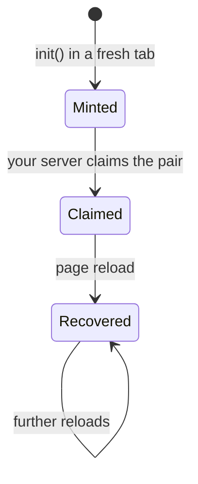

Every browser tab running the SDK gets a session. A session can't run tasks until your server *claims* it with your `ak_live_...` API key. Claiming is how Argide knows the page belongs to you: the browser proves it holds a freshly minted pairing code, and your server proves it holds your key.

## The session lifecycle



- **Minted** — `init()` created a new session and produced `{ sessionId, pairingCode }`. `do()` queues until the claim lands; an unclaimed session's tasks are refused by the server.
- **Claimed** — your server exchanged the pair for a claim. Tasks run.
- **Recovered** — after a page reload, the SDK re-attaches to the existing session. It is already claimed; no new pairing code is issued.

## Default path: the `claim` callback

Pass `claim` to `init` and the SDK calls it at exactly the right moment — only when a session is freshly minted, never on recovery. You don't track any state yourself.

```ts
ArgideAgent.init({
  apiUrl: "https://api.argide.ai",
  productId: "YOUR_PRODUCT_ID",
  claim: async ({ sessionId, pairingCode }) => {
    const res = await fetch("/api/argide/claim", {
      method: "POST",
      headers: { "Content-Type": "application/json" },
      body: JSON.stringify({ sessionId, pairingCode }),
    });
    if (!res.ok) throw new Error(`claim failed: HTTP ${res.status}`);
  },
});
```

<Note>
  The [quickstart](/agent-sdk/quickstart#3-add-the-claim-endpoint-on-your-server) has a ready-made Next.js route handler for the server side of this call.
</Note>

## Custom path: your own channel

If your architecture forwards the pairing code to your server some other way — an existing socket, your chatbot's backend — omit `claim` and read the session yourself:

```ts
const { sessionId, pairingCode, recovered } = await ArgideAgent.session();
if (!recovered) {
  // send the pair to your server, which claims with its ak_live_... key
}
```

<Warning>
  Claim only when `recovered` is `false`. A recovered session was already claimed; re-claiming returns `409 ALREADY_CLAIMED`, which is reserved as the signal that someone is using a stolen pairing code.
</Warning>

## The claim endpoint

Your server performs the claim with one HTTP call:

```bash
curl -X POST "https://api.argide.ai/api/agent/v1/sessions/claim" \
  -H "Authorization: Bearer ak_live_..." \
  -H "Content-Type: application/json" \
  -d '{"sessionId": "<sessionId>", "pairingCode": "<pairingCode>"}'
```

| Field | Value |
| ----- | ----- |
| Method | `POST` |
| Path | `/api/agent/v1/sessions/claim` |
| Auth | `Authorization: Bearer ak_live_...` |
| Body | `{ "sessionId": string, "pairingCode": string }` |
| Success | `2xx` — the session can now run tasks |
| Failure | `409 ALREADY_CLAIMED` — the session was already claimed (see below) |

## Treat ALREADY_CLAIMED as a security signal

`409 ALREADY_CLAIMED` is reserved for one situation: a pairing code that was already exchanged is being presented again. If your integration claims only when `recovered` is `false`, you should never see it in normal operation. When you do see it, treat it as someone replaying a stolen code — log it and alert. Don't retry the claim.
