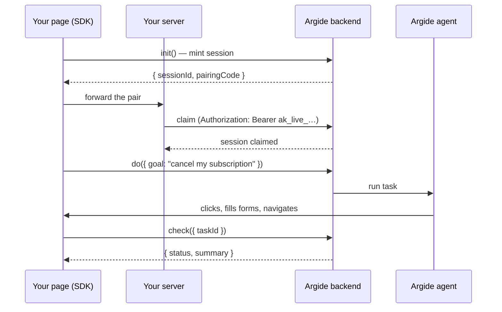

The Agent SDK (`@argide/agent`) loads a headless agent runtime in your end user's browser tab. An Argide agent can then drive that tab — clicking, filling forms, navigating — to complete a goal your own chatbot delegates to it.

Where the [chat widget](/setup/embed-widget) gives you a complete, Argide-owned chat UI, the Agent SDK ships no UI at all. Your product keeps its own assistant; Argide takes over only when a conversation turns into something that must be *done* in the app rather than answered.

## How it works

1. **The SDK mints a session.** `init()` runs in the tab and receives `{ sessionId, pairingCode }`.
2. **Your server claims it.** The browser forwards the pair to your backend, which exchanges it for a claim using your `ak_live_...` API key. Until then, the session can't run tasks.
3. **Your chatbot delegates a goal.** `do({ goal })` hands the agent a job and resolves with a `taskId` as soon as the task exists.
4. **The agent drives the tab.** Clicking, filling forms, navigating — in the user's own session, right in front of them.
5. **You read the outcome.** `check({ taskId })` returns the authoritative `{ status, summary }`.

## Security model

- **The browser never holds your API key.** The `ak_live_...` key lives on your server; the tab only ever sees a short-lived pairing code.
- **Unclaimed sessions can't act.** Tasks are refused until your server has claimed the session.
- **A pairing code is exchanged once.** Re-claiming an already-claimed session returns `409 ALREADY_CLAIMED` — reserved as the signal that a stolen code is being replayed.

[Claiming Sessions](/agent-sdk/claiming-sessions) covers this in depth.

## Integration requirements

- **Client-side tool execution.** Your stack must be able to execute tools in the browser — see [Client-Side Tools](/integration/client-side-tools).
- **Reconnect replay tolerance.** After a hard navigation, still-pending tool dispatches are replayed over the reconnect; your handlers must tolerate seeing them again.

## Get started

<CardGroup cols={2}>
  <Card title="Quickstart" icon="rocket" href="/agent-sdk/quickstart">
    Install, claim, and run your first task
  </Card>
  <Card title="Claiming Sessions" icon="key" href="/agent-sdk/claiming-sessions">
    The pairing-code security model
  </Card>
</CardGroup>
