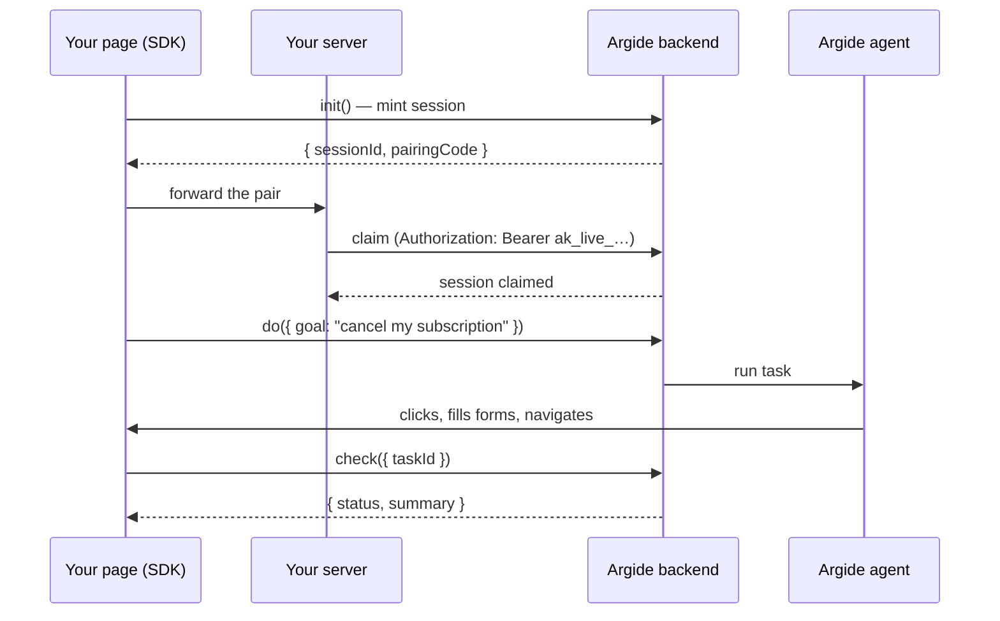
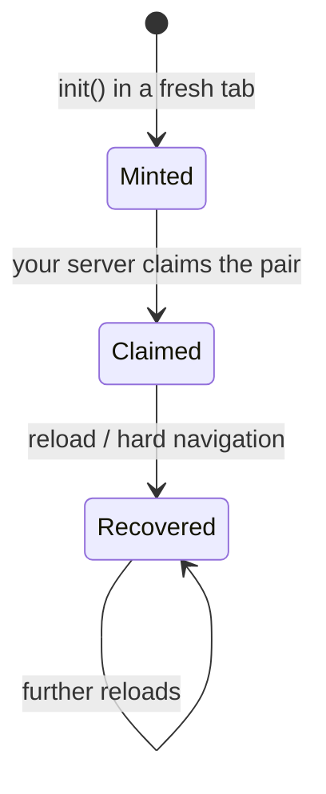

# Agent SDK Documentation Implementation Plan

> **For agentic workers:** REQUIRED SUB-SKILL: Use superpowers:subagent-driven-development (recommended) or superpowers:executing-plans to implement this plan task-by-task. Steps use checkbox (`- [ ]`) syntax for tracking.

**Goal:** Publish Diátaxis-structured docs for the `@argide/agent` browser SDK — 5 MDX pages in a new `agent-sdk/` folder plus a nav group in `docs.json`.

**Architecture:** One "Agent SDK" nav group (Overview → Quickstart → Claiming Sessions → Running Tasks → API Reference) added to the existing Documentation tab. Task 1 scaffolds nav + stub pages so link checking passes from the first commit; each later task replaces one stub with final content.

**Tech Stack:** Mintlify (MDX + `docs.json`), mermaid diagrams, `mint` CLI for verification.

## Global Constraints

- Repo: `/Users/abhinavkumar/docs`, branch `agent-sdk-docs` (already checked out; spec committed at `drafts/specs/2026-08-05-agent-sdk-docs-design.md`).
- Facts come only from `Ourguide-B2B/packages/agent/README.md` and the shop-clone reference integration. Never invent endpoints, options, status enum values, rate limits, or dashboard paths.
- Style (AGENTS.md): second person, active voice, short sentences. Frontmatter titles in Title Case; section headings in sentence case.
- Components available: `<Note>`, `<Warning>`, `<Tip>`, `<CodeGroup>`, `<Card>`, `<CardGroup>`, ```mermaid fences.
- Placeholder conventions: `YOUR_PRODUCT_ID`, `https://<your-argide-api-host>`, `ak_live_...`.
- Verification command: `mint broken-links` from the repo root (if `mint` is not installed, use `pnpm dlx mint broken-links`). Expected: exits 0 with no broken links reported.
- Every commit message ends with the trailer: `Co-Authored-By: Claude Fable 5 <noreply@anthropic.com>`.
- Write each page with the Write tool using the exact content given in the task (page content blocks are fenced with four backticks because pages contain three-backtick code blocks).

---

### Task 1: Nav group + page stubs

**Files:**
- Modify: `docs.json` (navigation.tabs[0].groups — insert after the "Agent" group)
- Create: `agent-sdk/overview.mdx`, `agent-sdk/quickstart.mdx`, `agent-sdk/claiming-sessions.mdx`, `agent-sdk/running-tasks.mdx`, `agent-sdk/api-reference.mdx` (stubs)

**Interfaces:**
- Produces: the five page paths `agent-sdk/overview`, `agent-sdk/quickstart`, `agent-sdk/claiming-sessions`, `agent-sdk/running-tasks`, `agent-sdk/api-reference` that Tasks 2–6 fill in and cross-link.

- [ ] **Step 1: Insert the nav group in `docs.json`**

In the `groups` array of the Documentation tab, directly after the object with `"group": "Agent"`, insert:

```json
{
  "group": "Agent SDK",
  "pages": [
    "agent-sdk/overview",
    "agent-sdk/quickstart",
    "agent-sdk/claiming-sessions",
    "agent-sdk/running-tasks",
    "agent-sdk/api-reference"
  ]
},
```

- [ ] **Step 2: Create the five stub pages**

Each stub is frontmatter plus a one-line body (replaced by Tasks 2–6). Use exactly these frontmatter values — later tasks keep them.

`agent-sdk/overview.mdx`:

```mdx
---
title: "Overview"
description: "A headless runtime that lets an Argide agent drive your web app"
---

Documentation for the Agent SDK is being written.
```

`agent-sdk/quickstart.mdx`:

```mdx
---
title: "Quickstart"
description: "Run your first agent task in about 15 minutes"
---

Documentation for the Agent SDK is being written.
```

`agent-sdk/claiming-sessions.mdx`:

```mdx
---
title: "Claiming Sessions"
description: "Pair browser sessions with your server before the agent can act"
---

Documentation for the Agent SDK is being written.
```

`agent-sdk/running-tasks.mdx`:

```mdx
---
title: "Running Tasks"
description: "Start, monitor, cancel, and recover agent tasks"
---

Documentation for the Agent SDK is being written.
```

`agent-sdk/api-reference.mdx`:

```mdx
---
title: "API Reference"
description: "Every method, option, type, and error in @argide/agent"
---

Documentation for the Agent SDK is being written.
```

- [ ] **Step 3: Verify**

Run: `cd /Users/abhinavkumar/docs && mint broken-links`
Expected: exit 0, no broken links (all five nav entries resolve to files). Also run `python3 -c "import json; json.load(open('docs.json'))"` — expected: no output (valid JSON).

- [ ] **Step 4: Commit**

```bash
git add docs.json agent-sdk/
git commit -m "Scaffold Agent SDK docs group with stub pages

Co-Authored-By: Claude Fable 5 <noreply@anthropic.com>"
```

---

### Task 2: Overview page

**Files:**
- Modify: `agent-sdk/overview.mdx` (replace entire file)

**Interfaces:**
- Consumes: page paths from Task 1.
- Produces: anchor `#integration-requirements` (from heading `## Integration requirements`) linked by Tasks 5 and 6.

- [ ] **Step 1: Write the full page**

Replace `agent-sdk/overview.mdx` with:

````mdx
---
title: "Overview"
description: "A headless runtime that lets an Argide agent drive your web app"
---

The Agent SDK (`@argide/agent`) loads a headless agent runtime in your end user's browser tab. An Argide agent can then drive that tab — clicking, filling forms, navigating — to complete a goal your own chatbot delegates to it.

Where the [chat widget](/setup/embed-widget) gives you a complete, Argide-owned chat UI, the Agent SDK ships no UI at all. Your product keeps its own assistant; Argide takes over only when a conversation turns into something that must be *done* in the app rather than answered.

## How it works



1. **The SDK mints a session.** `init()` runs in the tab and receives `{ sessionId, pairingCode }`.
2. **Your server claims it.** The browser forwards the pair to your backend, which exchanges it for a claim using your `ak_live_...` API key. Until then, the session can't run tasks.
3. **Your chatbot delegates a goal.** `do({ goal })` hands the agent a job and resolves with a `taskId` as soon as the task exists.
4. **The agent drives the tab.** Clicking, filling forms, navigating — in the user's own session, right in front of them.
5. **You read the outcome.** `check({ taskId })` returns the authoritative `{ status, summary }`.

## Security model

- **The browser never holds your API key.** The `ak_live_...` key lives on your server; the tab only ever sees a short-lived pairing code.
- **Unclaimed sessions can't act.** Tasks are refused until your server has claimed the session.
- **A pairing code is exchanged once.** Re-claiming an already-claimed session returns `409 ALREADY_CLAIMED` — reserved as the signal that a stolen code is being replayed.

[Claiming Sessions](/agent-sdk/claiming-sessions) covers this in depth.

## Integration requirements

- **Client-side tool execution.** Your stack must be able to execute tools in the browser — see [Client-Side Tools](/integration/client-side-tools).
- **Reconnect replay tolerance.** After a hard navigation, still-pending tool dispatches are replayed over the reconnect; your handlers must tolerate seeing them again.

## Get started

<CardGroup cols={2}>
  <Card title="Quickstart" icon="rocket" href="/agent-sdk/quickstart">
    Install, claim, and run your first task
  </Card>
  <Card title="Claiming Sessions" icon="key" href="/agent-sdk/claiming-sessions">
    The pairing-code security model
  </Card>
</CardGroup>
````

- [ ] **Step 2: Verify**

Run: `cd /Users/abhinavkumar/docs && mint broken-links`
Expected: exit 0 (links to `/setup/embed-widget`, `/integration/client-side-tools`, and the two agent-sdk stubs all resolve).

- [ ] **Step 3: Commit**

```bash
git add agent-sdk/overview.mdx
git commit -m "Write Agent SDK overview page

Co-Authored-By: Claude Fable 5 <noreply@anthropic.com>"
```

---

### Task 3: Quickstart page

**Files:**
- Modify: `agent-sdk/quickstart.mdx` (replace entire file)

**Interfaces:**
- Consumes: page paths from Task 1.
- Produces: anchor `#3-add-the-claim-endpoint-on-your-server` (from heading `## 3. Add the claim endpoint on your server`) linked by Task 4.

- [ ] **Step 1: Write the full page**

Replace `agent-sdk/quickstart.mdx` with:

````mdx
---
title: "Quickstart"
description: "Run your first agent task in about 15 minutes"
---

Integrate `@argide/agent` end to end: install the package, initialize it in the browser, add the server-side claim endpoint, and run your first task.

## Before you start

You need:

- Your Product ID and an `ak_live_...` API key from your [dashboard](https://dashboard.argide.ai).
- A backend that can keep the API key secret and expose one new endpoint.

## 1. Install

<CodeGroup>

```bash npm
npm install @argide/agent
```

```bash pnpm
pnpm add @argide/agent
```

```bash yarn
yarn add @argide/agent
```

</CodeGroup>

## 2. Initialize in the browser

Call `init` once, wherever your page boots. It is idempotent and safe under React StrictMode — call it from anywhere, any number of times.

```ts
import { ArgideAgent } from "@argide/agent";

ArgideAgent.init({
  apiUrl: "https://<your-argide-api-host>",
  productId: "YOUR_PRODUCT_ID",
  // Called only when a session is freshly minted — never on recovery.
  claim: async ({ sessionId, pairingCode }) => {
    const res = await fetch("/api/argide/claim", {
      method: "POST",
      headers: { "Content-Type": "application/json" },
      body: JSON.stringify({ sessionId, pairingCode }),
    });
    if (!res.ok) throw new Error(`claim failed: HTTP ${res.status}`);
  },
});
```

<Note>
  On the server (SSR), `init` warns and does nothing. No session is minted until it runs in a real browser.
</Note>

## 3. Add the claim endpoint on your server

The `claim` callback above posts the session's `{ sessionId, pairingCode }` pair to your backend. Your backend exchanges the pair for a claim using your `ak_live_...` key — until that happens, the session can't run tasks.

Create the endpoint the callback calls:

<CodeGroup>

```ts Next.js — app/api/argide/claim/route.ts
import { NextResponse } from "next/server";

export async function POST(req: Request) {
  const { sessionId, pairingCode } = await req.json();
  if (
    typeof sessionId !== "string" || !sessionId ||
    typeof pairingCode !== "string" || !pairingCode
  ) {
    return NextResponse.json(
      { error: "sessionId and pairingCode are required strings" },
      { status: 400 },
    );
  }

  const res = await fetch(
    `${process.env.NEXT_PUBLIC_ARGIDE_AGENT_API_URL}/api/agent/v1/sessions/claim`,
    {
      method: "POST",
      headers: {
        "Content-Type": "application/json",
        Authorization: `Bearer ${process.env.ARGIDE_AGENT_API_KEY}`,
      },
      body: JSON.stringify({ sessionId, pairingCode }),
      cache: "no-store",
    },
  );
  return new NextResponse(await res.text(), {
    status: res.status,
    headers: { "Content-Type": "application/json" },
  });
}
```

</CodeGroup>

Set the environment variables:

```bash .env.local
NEXT_PUBLIC_ARGIDE_AGENT_API_URL=https://<your-argide-api-host>
ARGIDE_AGENT_API_KEY=ak_live_...
```

<Warning>
  The `ak_live_...` key must never ship to the browser. Keep it in server-side environment variables only.
</Warning>

Any backend works — the endpoint just forwards the pair to `POST {apiUrl}/api/agent/v1/sessions/claim` with an `Authorization: Bearer ak_live_...` header. See [Claiming Sessions](/agent-sdk/claiming-sessions) for the raw HTTP contract.

## 4. Run a task

```ts
const { taskId } = await ArgideAgent.do({ goal: "cancel my subscription" });

const outcome = await ArgideAgent.check({ taskId });
// { taskId, status, summary }
```

`do()` resolves as soon as the task exists — not when it finishes — and waits internally for init and the claim to complete first, so you never have to check "is it ready".

## 5. Watch it work (optional)

```ts
const off = ArgideAgent.onActivity((activity) => {
  // { kind: "tool-start" | "tool-end" | "idle", ... }
  console.log(activity);
});
```

## Next steps

<CardGroup cols={2}>
  <Card title="Claiming Sessions" icon="key" href="/agent-sdk/claiming-sessions">
    The security model behind the pairing-code exchange
  </Card>
  <Card title="Running Tasks" icon="play" href="/agent-sdk/running-tasks">
    Task lifecycle, busy sessions, and error handling
  </Card>
  <Card title="API Reference" icon="book" href="/agent-sdk/api-reference">
    Every method, option, and error code
  </Card>
</CardGroup>
````

- [ ] **Step 2: Verify**

Run: `cd /Users/abhinavkumar/docs && mint broken-links`
Expected: exit 0.

- [ ] **Step 3: Commit**

```bash
git add agent-sdk/quickstart.mdx
git commit -m "Write Agent SDK quickstart with server claim endpoint

Co-Authored-By: Claude Fable 5 <noreply@anthropic.com>"
```

---

### Task 4: Claiming Sessions page

**Files:**
- Modify: `agent-sdk/claiming-sessions.mdx` (replace entire file)

**Interfaces:**
- Consumes: quickstart anchor `/agent-sdk/quickstart#3-add-the-claim-endpoint-on-your-server` from Task 3.
- Produces: anchor `#custom-path-your-own-channel` (from heading `## Custom path: your own channel`) linked by Task 6.

- [ ] **Step 1: Write the full page**

Replace `agent-sdk/claiming-sessions.mdx` with:

````mdx
---
title: "Claiming Sessions"
description: "Pair browser sessions with your server before the agent can act"
---

Every browser tab running the SDK gets a session. A session can't run tasks until your server *claims* it with your `ak_live_...` API key. Claiming is how Argide knows the page belongs to you: the browser proves it holds a freshly minted pairing code, and your server proves it holds your key.

## The session lifecycle



- **Minted** — `init()` created a new session and produced `{ sessionId, pairingCode }`. Tasks are refused.
- **Claimed** — your server exchanged the pair for a claim. Tasks run.
- **Recovered** — after a reload or hard navigation, the SDK re-attaches to the existing session. It is already claimed; no new pairing code is issued.

## Default path: the `claim` callback

Pass `claim` to `init` and the SDK calls it at exactly the right moment — only when a session is freshly minted, never on recovery. You don't track any state yourself.

```ts
ArgideAgent.init({
  apiUrl: "https://<your-argide-api-host>",
  productId: "YOUR_PRODUCT_ID",
  claim: async ({ sessionId, pairingCode }) => {
    const res = await fetch("/api/argide/claim", {
      method: "POST",
      headers: { "Content-Type": "application/json" },
      body: JSON.stringify({ sessionId, pairingCode }),
    });
    if (!res.ok) throw new Error(`claim failed: HTTP ${res.status}`);
  },
});
```

<Note>
  The [quickstart](/agent-sdk/quickstart#3-add-the-claim-endpoint-on-your-server) has a ready-made Next.js route handler for the server side of this call.
</Note>

## Custom path: your own channel

If your architecture forwards the pairing code to your server some other way — an existing socket, your chatbot's backend — omit `claim` and read the session yourself:

```ts
const { sessionId, pairingCode, recovered } = await ArgideAgent.session();
if (!recovered) {
  // send the pair to your server, which claims with its ak_live_... key
}
```

<Warning>
  Claim only when `recovered` is `false`. A recovered session was already claimed; re-claiming returns `409 ALREADY_CLAIMED`, which is reserved as the signal that someone is using a stolen pairing code.
</Warning>

## The claim endpoint

Your server performs the claim with one HTTP call:

```bash
curl -X POST "https://<your-argide-api-host>/api/agent/v1/sessions/claim" \
  -H "Authorization: Bearer ak_live_..." \
  -H "Content-Type: application/json" \
  -d '{"sessionId": "<sessionId>", "pairingCode": "<pairingCode>"}'
```

| Field | Value |
| ----- | ----- |
| Method | `POST` |
| Path | `/api/agent/v1/sessions/claim` |
| Auth | `Authorization: Bearer ak_live_...` |
| Body | `{ "sessionId": string, "pairingCode": string }` |
| Success | `2xx` — the session can now run tasks |
| Failure | `409 ALREADY_CLAIMED` — the session was already claimed (see below) |

## Treat ALREADY_CLAIMED as a security signal

`409 ALREADY_CLAIMED` is reserved for one situation: a pairing code that was already exchanged is being presented again. If your integration claims only when `recovered` is `false`, you should never see it in normal operation. When you do see it, treat it as someone replaying a stolen code — log it and alert. Don't retry the claim.
````

- [ ] **Step 2: Verify**

Run: `cd /Users/abhinavkumar/docs && mint broken-links`
Expected: exit 0 (including the quickstart anchor link).

- [ ] **Step 3: Commit**

```bash
git add agent-sdk/claiming-sessions.mdx
git commit -m "Write Agent SDK claiming sessions guide

Co-Authored-By: Claude Fable 5 <noreply@anthropic.com>"
```

---

### Task 5: Running Tasks page

**Files:**
- Modify: `agent-sdk/running-tasks.mdx` (replace entire file)

**Interfaces:**
- Consumes: overview anchor `/agent-sdk/overview#integration-requirements` from Task 2.

- [ ] **Step 1: Write the full page**

Replace `agent-sdk/running-tasks.mdx` with:

````mdx
---
title: "Running Tasks"
description: "Start, monitor, cancel, and recover agent tasks"
---

A task is one goal handed to the agent. This page covers the full lifecycle: starting a task, the one-goal-at-a-time rule, reading the outcome, cancelling, and what happens when the agent navigates the page out from under itself.

## Start a task

```ts
const { taskId } = await ArgideAgent.do({ goal: "cancel my subscription" });
```

`do()` resolves as soon as the task exists — not when it finishes. It also waits internally for `init` and the claim to complete, so you can call it right after `init` with no readiness check.

## One goal at a time

Each session runs at most one task. What `do()` does while a task is running depends on the goal:

| While a task is running... | Result |
| -------------------------- | ------ |
| `do()` with a **different** goal | Rejects with `409 SESSION_BUSY`. Wait for the task to settle, or `cancel()` it first. |
| `do()` with the **same** goal | Treated as a rejoin — resolves with the same `taskId`. |

<Tip>
  The same-goal rejoin is what makes re-dispatching after a hard navigation safe: fire the same `do()` again after a reload and you re-attach to the running task instead of erroring.
</Tip>

## Read the outcome

```ts
const outcome = await ArgideAgent.check({ taskId });
// { taskId, status, summary }
```

`check()` is the authoritative source for how a task ended. Activity events (below) are ephemeral and per-tab; when you need to decide what actually happened, use `check()`.

## End a task early

```ts
await ArgideAgent.cancel({ taskId });
```

## Handle errors

`check()` and `cancel()` reject on any non-2xx response — wrap them:

```ts
try {
  await ArgideAgent.cancel({ taskId });
} catch (err) {
  // 404 — unknown task, or a task belonging to another session
  // 409 — the task is already terminal
}
```

## Watch progress

Three signals, three jobs:

| Signal | What it tells you | Use it for |
| ------ | ----------------- | ---------- |
| `onActivity(cb)` | Ephemeral, per-tab events as the agent works: `{ kind: "tool-start" \| "tool-end" \| "idle", ... }` | Live "agent is working" UI |
| `onStateChange` (an `init` option) | Facade lifecycle: `"starting" \| "ready" \| "error" \| "stopped"` | Enabling or disabling your entry points |
| `check({ taskId })` | The authoritative task outcome | Deciding what happened |

```ts
const off = ArgideAgent.onActivity((activity) => {
  setSpinner(activity.kind !== "idle");
});
// later, to unsubscribe: off()
```

## Surviving hard navigations

The agent may navigate the tab as part of a task. When that happens:

1. The SDK recovers the existing session on load — no new claim is needed.
2. Still-pending tool dispatches are replayed over the reconnect. Your stack must tolerate seeing them again — see [integration requirements](/agent-sdk/overview#integration-requirements).
3. Re-sending the same goal with `do()` re-attaches to the running task and resolves with the same `taskId`.
````

- [ ] **Step 2: Verify**

Run: `cd /Users/abhinavkumar/docs && mint broken-links`
Expected: exit 0.

- [ ] **Step 3: Commit**

```bash
git add agent-sdk/running-tasks.mdx
git commit -m "Write Agent SDK running tasks guide

Co-Authored-By: Claude Fable 5 <noreply@anthropic.com>"
```

---

### Task 6: API Reference page + final verification

**Files:**
- Modify: `agent-sdk/api-reference.mdx` (replace entire file)

**Interfaces:**
- Consumes: anchors `/agent-sdk/claiming-sessions#custom-path-your-own-channel` (Task 4) and `/agent-sdk/overview#integration-requirements` (Task 2).

- [ ] **Step 1: Write the full page**

Replace `agent-sdk/api-reference.mdx` with:

````mdx
---
title: "API Reference"
description: "Every method, option, type, and error in @argide/agent"
---

```ts
import { ArgideAgent, startAgentRuntime } from "@argide/agent";
```

`ArgideAgent` is a facade that owns one runtime per page — it is what most integrations use. [`startAgentRuntime`](#startagentruntime) is the lower-level primitive it wraps.

## ArgideAgent.init(options)

Initializes the page's runtime. Idempotent and safe under React StrictMode — call it from anywhere, any number of times. On the server (SSR) it warns and does nothing; no session is minted until it runs in a browser.

| Option | Type | Required | Description |
| ------ | ---- | -------- | ----------- |
| `apiUrl` | `string` | Yes | Your Argide API host, e.g. `https://<your-argide-api-host>` |
| `productId` | `string` | Yes | The product this page belongs to |
| `claim` | `({ sessionId, pairingCode }) => Promise<void>` | No | Called only when a session is freshly minted — never on recovery. Exchange the pair for a claim via your server. Omit to claim through [your own channel](/agent-sdk/claiming-sessions#custom-path-your-own-channel). |
| `onStateChange` | `(state) => void` | No | Reports the facade lifecycle: `"starting" \| "ready" \| "error" \| "stopped"` |

## ArgideAgent.do({ goal })

Starts a task, or rejoins the running one.

- Returns `Promise<{ taskId: string }>` — resolves as soon as the task exists, not when it finishes. Waits internally for init and the claim first.
- Rejects with `409 SESSION_BUSY` when called with a *different* goal while a task is running.
- Called with the *same* goal as the running task, it resolves with the same `taskId` (rejoin).

## ArgideAgent.check({ taskId })

Fetches the authoritative outcome.

- Returns `Promise<{ taskId, status, summary }>`.
- Rejects on any non-2xx, including `404` for a task that is unknown or belongs to another session.

## ArgideAgent.cancel({ taskId })

Ends the task early.

- The returned promise settles when the cancel completes.
- Rejects on any non-2xx, including `404` (unknown or foreign task) and `409` (task already terminal).

## ArgideAgent.onActivity(callback)

Subscribes to ephemeral, per-tab activity events. Returns an unsubscribe function.

```ts
const off = ArgideAgent.onActivity((activity) => {
  // { kind: "tool-start" | "tool-end" | "idle", ... }
});
// later, to unsubscribe: off()
```

Additional event fields vary by `kind`. Activity is not persisted — for the authoritative outcome use `check()`.

## ArgideAgent.session()

Returns `Promise<{ sessionId, pairingCode, recovered }>` for claiming through your own channel.

Claim only when `recovered` is `false` — a recovered session is already claimed, and re-claiming returns `409 ALREADY_CLAIMED`. See [Claiming Sessions](/agent-sdk/claiming-sessions).

## Errors

| Error | Status | Surfaces from | What it means |
| ----- | ------ | ------------- | ------------- |
| `SESSION_BUSY` | 409 | `do()` | A task with a different goal is still running. Wait or `cancel()` first. |
| `ALREADY_CLAIMED` | 409 | the claim endpoint | The session was already claimed. Reserved as the stolen-pairing-code signal — do not retry. |
| Not found | 404 | `check()`, `cancel()` | Unknown `taskId`, or a task belonging to another session. |
| Conflict | 409 | `cancel()` | The task is already terminal. |

## startAgentRuntime

`ArgideAgent` owns one runtime per page. Drop down to the primitive it wraps when you need more than one product on a page, or you want to manage the lifecycle yourself:

```ts
import { startAgentRuntime } from "@argide/agent";

const argide = await startAgentRuntime({ apiUrl, productId });
// argide.{ sessionId, pairingCode, recovered, do, check, cancel, onActivity, stop }
```

At this level the claim-on-recovered rule and concurrent-start guarding are your responsibility: check `recovered` before claiming, and guard against starting two runtimes concurrently yourself.

<Card title="Integration requirements" icon="list-check" href="/agent-sdk/overview#integration-requirements">
  What your stack must support before going live
</Card>
````

- [ ] **Step 2: Final verification**

Run: `cd /Users/abhinavkumar/docs && mint broken-links`
Expected: exit 0 across the whole site.

Then spot-check rendering: run `mint dev` briefly and load `/agent-sdk/overview` and `/agent-sdk/api-reference` (mermaid diagrams render, tables render, CodeGroups tab correctly). Stop the dev server afterwards.

- [ ] **Step 3: Commit**

```bash
git add agent-sdk/api-reference.mdx
git commit -m "Write Agent SDK API reference

Co-Authored-By: Claude Fable 5 <noreply@anthropic.com>"
```
